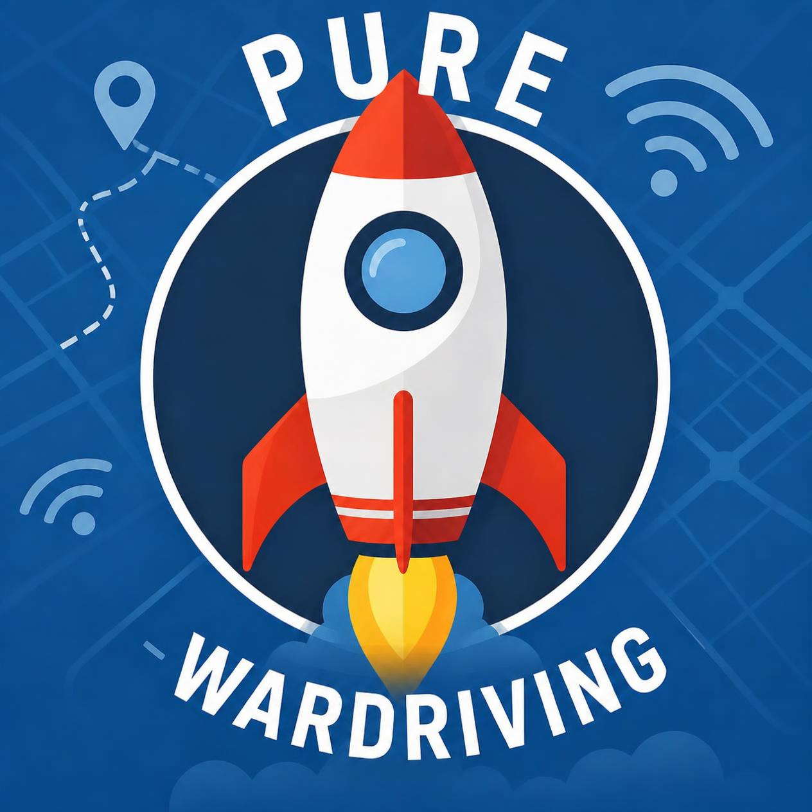

# PURE WARDRIVER

<p align="center"></p>
<p align="center">
  <b>Pure wardriving firmware for the ESP32 Marauder V8 — no pentest tools, just wardriving.</b>
</p>

## What it is

PURE WARDRIVER turns a Marauder V8 into a dedicated wardriving device:

- **SCAN** — WiFi + BLE wardriving with GPS logging (Wigle-compatible CSV)
- **SYNC** — upload log files to [WDGWars](https://wdgwars.pl), [WiGLE](https://wigle.net), or both
- **MENU** — upload file browser, Saved WiFi, geofences, GPS tools, settings
- Boot self-test, blue touch UI, 5s SCAN toggle guard + pocket-press guard

## First run

1. Copy the ready-made files from `sd-card/` in this repo onto the
   microSD card (root directory) and fill in your values:
   `wifi-upload-credentials.txt`:
   ```
   ssid=YourWiFiName
   pass=YourWiFiPassword
   ```
   API keys, either as `API.txt`:
   ```
   wdg_key=YOUR_WDGWARS_KEY
   wu=YOUR_WIGLE_USERNAME
   wt=YOUR_WIGLE_TOKEN
   ```
   or as three single-value files (same effect):
   `wdg_key.txt`, `wigle_api_name.txt`, `wigle_api_token.txt`
   (each file holds just the key, nothing else).
   Untouched `YOUR_...` placeholders are ignored by the firmware.
2. Power on: the firmware loads the API keys and connects to your WiFi
   right away to verify the link. If no upload starts within 5 minutes,
   WiFi switches off again to save battery — opening SYNC reconnects.
3. Wait for GPS fix.
4. Press **SCAN** to start logging (`/wardrive_N.log` on SD).
5. Press **STOP** (5s guard against double-taps) to stop.
6. Press **SYNC**, pick a log file, choose WDGWars / WiGLE / both.

## Hardware

PURE WARDRIVER is built primarily for the **Marauder V8**
(ESP32-C5, touch display, GPS, SD) —
[Firmware direct download](https://raw.githubusercontent.com/RocketDevil/PURE-WARDRIVER/main/firmware/Pure-Wardrive-V8.bin)
([all files](firmware/)).

More devices are in progress. In testing right now: **M5 Cardputer ADV**
(keyboard instead of touch) —
[Firmware direct download](https://raw.githubusercontent.com/RocketDevil/PURE-WARDRIVER/main/firmware/Pure-Wardrive-CP-ADV.bin).
Feedback welcome!

## Flashing

Easiest: [=> WEB FLASHER <=](https://thelastoutpostworkshop.github.io/ESPConnect/)
with `firmware/Pure-Wardrive-V8.bin` (offset `0x0`).

Alternatively use `C5_Py_Flasher_for_v8/c5_flasher.py` or `esptool.py`
(ESP32-C5, 8 MB flash, `default_8MB` partition scheme).

## Building (V8)

Requires Arduino-ESP32 core 3.3.4 and the libraries in your sketchbook.
Display setup: copy `tft-setups/User_Setup_marauder_v8.h` into your
sketchbook `TFT_eSPI` library and enable it in `User_Setup_Select.h`.

```powershell
.\tools\arduino-cli.exe compile `
  --fqbn "esp32:esp32:esp32c5:FlashSize=8M,PartitionScheme=default_8MB,PSRAM=enabled" `
  --build-property "compiler.cpp.extra_flags=-DMARAUDER_V8" `
  --warnings none ./esp32_marauder --output-dir ./build_pure_wardrive_v8
```

Requires Arduino-ESP32 core 3.3.4 and the libraries in your sketchbook
(see `.github/workflows/build_parallel.yml` for versions).

## Building (M5 Cardputer ADV, <ins> Still Testing this Build atm!!! </ins>)

Uses its own environment in `sketchbooks/CP-ADV` (core 2.0.11):

```powershell
.\tools\arduino-cli.exe compile --config-file sketchbooks/CP-ADV/arduino-cli.yaml `
  --fqbn "esp32:esp32:esp32s3:PartitionScheme=min_spiffs,FlashSize=8M,PSRAM=disabled" `
  --build-property "compiler.cpp.extra_flags=-DMARAUDER_CARDPUTER_ADV" `
  --warnings none ./esp32_marauder --output-dir ./build_cpadv
```


## Attribution / License

Based on [ESP32Marauder](https://github.com/justcallmekoko/ESP32Marauder)
by Just Call Me Koko, MIT licensed. This project keeps the original
`LICENSE` (MIT) and copyright notice. All pentest/attack modules were
removed; wardrive, GPS, SD, display and upload code paths are retained
from upstream.
